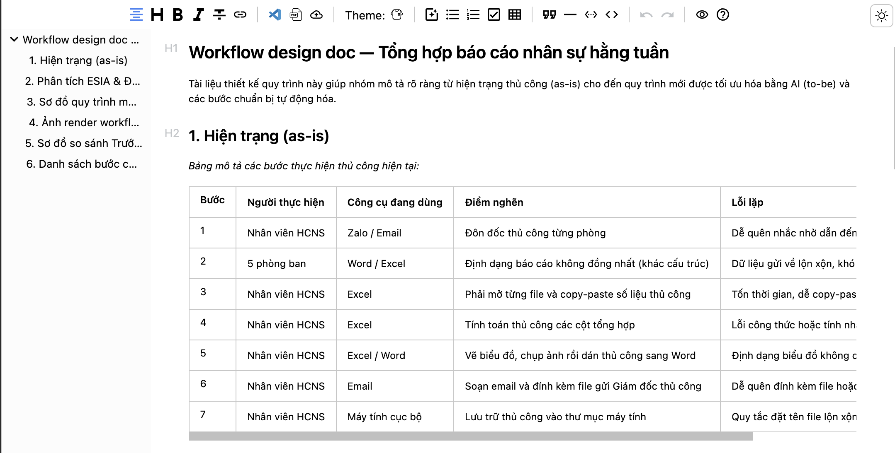
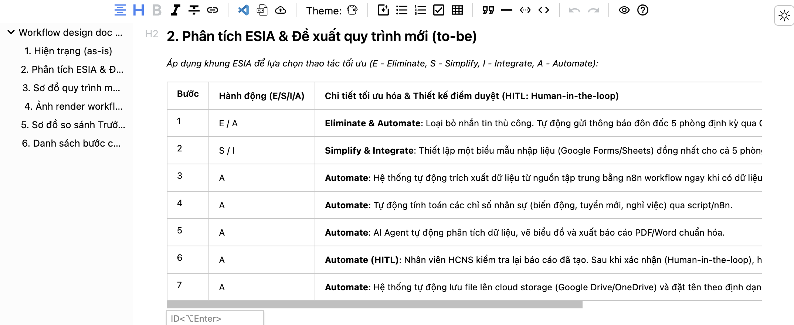
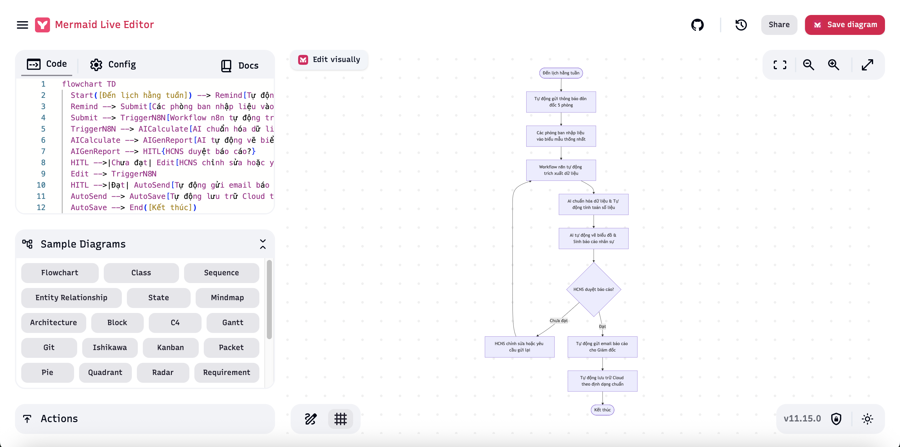
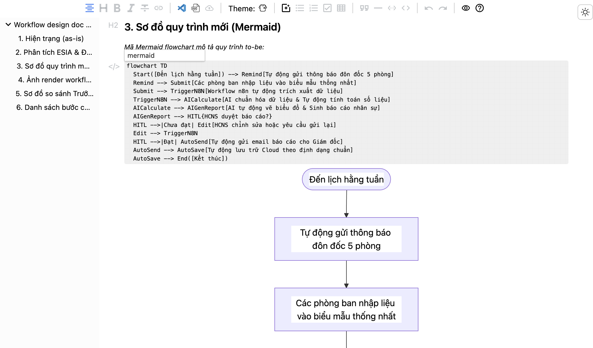
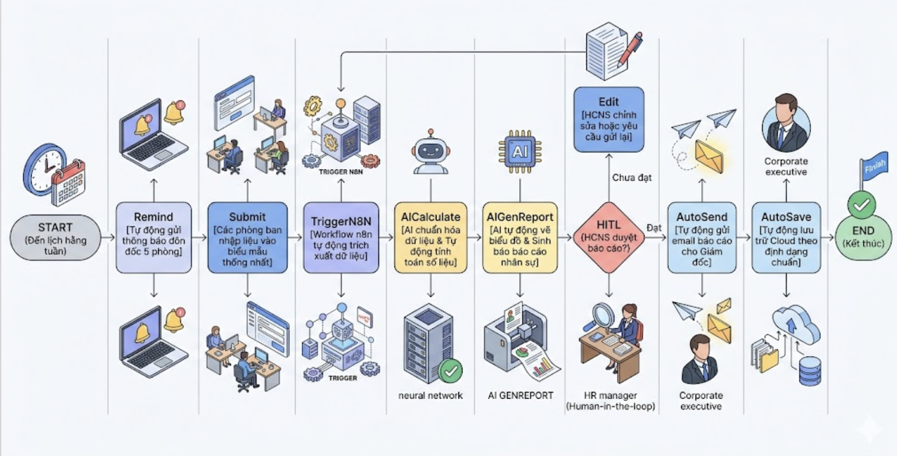
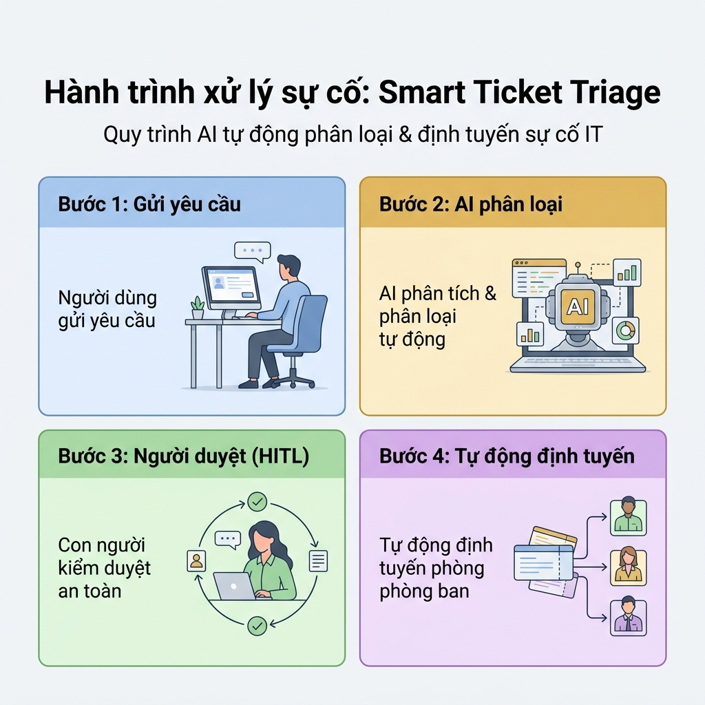

# Lab S2 — Thiết kế workflow: từ hiện trạng đến quy trình mới bằng AI

> **Session 2 · Ngày 1 · Tư duy:** Workflow Thinking — "Thiết kế quy trình trước khi tự động"
> **Chữ kí:** _Tự động hóa một quy trình sai chỉ làm cho sai diễn ra nhanh hơn. Vẽ hiện trạng, dùng ESIA để gọt, rồi mới thiết kế workflow mới._
> **Mục tiêu:** Ra 1 Workflow design doc hoàn chỉnh — hiện trạng (as-is) + ESIA + sơ đồ Mermaid + ảnh render workflow + sơ đồ so sánh Trước & Sau (Before & After) + sơ đồ kể chuyện (Storytelling Infographic) + danh sách bước cần tự động — sẵn sàng đưa sang n8n ở S3.
> **Thời lượng:** ~110 phút (trong session 3h30) · **Công cụ:** Antigravity / Codex, Mermaid, Codex / Nano Banana (Gemini), mermaid.live
> **Đầu vào (chained):** Use case one-pager từ Session 1. **Đầu ra:** Workflow design doc → dựng trên n8n (S3).

## 1. Mục tiêu lab

Sau khi hoàn thành lab, học viên sẽ:

- Vẽ được **hiện trạng (as-is)** của bài toán đã chọn ở S1 dưới dạng bảng Bước | Người | Công cụ | Nghẽn | Lỗi.
- Áp được khung **ESIA** (Eliminate – Simplify – Integrate – Automate) để đề xuất quy trình mới (to-be), đánh dấu đúng thao tác cho từng bước và xác định bước nào cần người duyệt (HITL) trước khi tự động.
- Dùng AI (Antigravity / Codex) sinh được **code Mermaid** hợp lệ cho quy trình to-be, nhận diện đúng 1 trong 3 kiểu workflow (tuyến tính / song song / có điều kiện).
- Render được Mermaid thành **ảnh đẹp** bằng Codex / Nano Banana (Gemini).
- Vẽ được **sơ đồ so sánh Trước & Sau (Before & After)** thể hiện tác động toàn diện sau khi áp dụng AI bằng Codex / Nano Banana.
- Vẽ được **sơ đồ kể chuyện: Storytelling Infographic** thể hiện trực quan quy trình mới, vai trò của AI và lợi ích mang lại.
- Gộp thành 1 **Workflow design doc** hoàn chỉnh — artifact bàn giao sang S3.

> [!IMPORTANT]
> **NGUYÊN TẮC CỐT LÕI:** AI chỉ là một mắt xích xử lý. Người thiết kế quy trình (Workflow Builder) mới là người chịu trách nhiệm tối cao về: đánh giá đúng hiện trạng, chọn đúng bước để tự động, và xác định đúng điểm cần con người duyệt. Chưa vẽ rõ as-is mà đã đòi "dựng n8n" = tự động hóa sự lộn xộn.

## 2. Quy tắc an toàn bắt buộc

- **Chỉ dùng dữ liệu mô phỏng / synthetic.** Tuyệt đối không đưa thông tin quy trình thật, số liệu kinh doanh thật, tên khách hàng / nhân viên thật, hay dữ liệu định danh cá nhân (PII) của VTN vào design doc hay prompt AI.
- **Tuân thủ Luật TTNT 134/2025/QH15:** với mọi bước dự định "Automate / giao AI", ghi rõ (a) bước nào con người vẫn phải duyệt trước khi đi tiếp, và (b) bước nào có rủi ro về quyền lợi người dùng thì **bắt buộc có Human-in-the-loop (HITL)**. Đây chính là "điểm con người duyệt" trong thiết kế.
- **Không lộ API key / token / credential** vào prompt hay design doc. Nếu quy trình thực tế cần kết nối hệ thống, chỉ mô tả bằng tên hệ thống (vd: "đọc Google Sheet"), không dán key.
- **Sơ đồ Mermaid là tài liệu nội bộ**: không dán vào prompt AI các ghi chú nhạy cảm (lương, mật khẩu, quy tắc phê duyệt đặc quyền).

## 3. Tài nguyên sử dụng

- Quy trình mẫu (as-is) để GV demo + HV tham chiếu: [`synthetic-data/sample-process-as-is-hcns-baocao-tuan.md`](synthetic-data/sample-process-as-is-hcns-baocao-tuan.md) — quy trình HCNS tổng hợp báo cáo nhân sự hằng tuần.
- Template design doc để HV điền: [`templates/workflow-design-doc-template.md`](templates/workflow-design-doc-template.md).
- Mẫu câu lệnh (prompt templates) cho học viên:
  - Phân tích quy trình bằng ESIA: [`templates/prompt/prompt-esia-analysis.md`](templates/prompt/prompt-esia-analysis.md)
  - Vẽ quy trình mới: [`templates/prompt/prompt-generate-mermaid.md`](templates/prompt/prompt-generate-mermaid.md)
  - Xuất ảnh sơ đồ: [`templates/prompt/prompt-render-mermaid.md`](templates/prompt/prompt-render-mermaid.md)
  - Vẽ sơ đồ so sánh Trước & Sau: [`templates/prompt/prompt-before-after-infographic.md`](templates/prompt/prompt-before-after-infographic.md)
  - Vẽ sơ đồ kể chuyện: [`templates/prompt/prompt-storytelling-infographic.md`](templates/prompt/prompt-storytelling-infographic.md)
  - Đánh giá tuân thủ & HITL: [`templates/prompt/prompt-compliance-check.md`](templates/prompt/prompt-compliance-check.md)
- Lý thuyết kèm theo (just-in-time): [`01-slides/designs/session-02-theory.md`](../../01-slides/designs/session-02-theory.md).
- Thẻ xử lý lỗi thường gặp: [`trouble-cards.md`](trouble-cards.md).
- Nhóm chậm — fallback input: [`fallback-inputs/README.md`](fallback-inputs/README.md).
- Use case one-pager từ **Session 1** (mỗi nhóm tự mang theo).

## 4. Cấu trúc thời gian gợi ý

| Phần                                      | Thời lượng | Kết quả cần đạt                                                                     |
| ------------------------------------------ | ------------- | ---------------------------------------------------------------------------------------- |
| A — Demo dẫn nhập của GV               | ~10 phút     | HV thấy rõ "as-is lộn xộn → ESIA → to-be có chỗ cho AI".                         |
| B — Thực hành có hướng dẫn (L1–L2) | ~30 phút     | Bảng as-is hoàn chỉnh + bảng ESIA đã chốt E/S/I/A.                                |
| C — Bài tập nhóm (L3–L6)              | ~50 phút     | Code Mermaid hợp lệ + ảnh render workflow + sơ đồ Trước & Sau + sơ đồ kể chuyện + design doc gộp. |
| D — Đánh dấu HITL + tự kiểm          | ~10 phút     | Mỗi bước Automate có ghi rõ cần người duyệt hay không.                         |
| E — Checkpoint bàn giao                  | ~10 phút     | Nghiệm thu SLI/SLO + trình bày 1 phút.                                               |

> Nếu lớp chậm, **ưu tiên L1 + L2 + L3** (as-is + ESIA + Mermaid). L4, L5, L6 (render ảnh, vẽ sơ đồ so sánh, gộp design doc) có thể nhóm dùng fallback template, chèn ảnh sau.

## 5. Phần A — Demo dẫn nhập của giảng viên

> [!NOTE] Mỏ neo Slide: Slide 3 (Vẽ hiện trạng TRƯỚC) — Slide 4 (ESIA) — Slide 6 (Mermaid)

- GV mở quy trình mẫu HCNS `synthetic-data/sample-process-as-is-hcns-baocao-tuan.md`, chiếu lên màn hình.
- **Demo 3 trong 1 (≤8 phút):**
  1. Đọc nhanh 7 bước as-is, chỉ ra 2 điểm nghẽn rõ ràng (bước 1 quên đôn đốc; bước 3–4 copy-paste sai số).
  2. Áp ESIA ngay trên bảng: bước 1 → **Eliminate** (tự động nhắc); bước 2 → **Simplify** (đồng nhất template); bước 3–4 → **Automate** (AI chuẩn hóa + tổng hợp).
  3. Dùng mẫu prompt tại [templates/prompt/prompt-generate-mermaid.md](templates/prompt/prompt-generate-mermaid.md) (hoặc sao chép mẫu prompt ở mục C1) để sinh code Mermaid, sau đó dán vào mermaid.live cho học viên thấy sơ đồ hiện ra ngay.
- **Câu chốt của GV:** _"Chưa cần n8n, chưa cần code. Mình chỉ cần 1 bản vẽ quy trình đúng. Bản vẽ sai → tự động hóa càng nhanh thì sai càng lan nhanh."_

**Học viên quan sát & ghi câu hỏi:**

- Quy trình của mình có bước nào "chỉ 1 người biết làm" không? (rủi ro phụ thuộc).
- Có bước nào lặp đi lặp lại nhưng chả ai thích làm không? (ứng viên Automate).
- Có bước nào một khi sai thì hậu quả nặng (phê duyệt chi phí, gửi ngoài) không? (bắt buộc HITL).

## 6. Phần B — Thực hành có hướng dẫn (L1–L2)

> [!NOTE] Mỏ neo Slide: Slide 3 (Vẽ hiện trạng) — Slide 4 (ESIA)

### Bước B1 — L1: Vẽ hiện trạng (as-is) (~15 phút)

- Mở **Use case one-pager từ S1** của nhóm. Lấy "cách làm thủ công hôm nay" làm gốc.
- Vẽ bảng as-is vào 1 trang (Google Doc / Antigravity / giấy A3). Bắt buộc 5 cột:

| Bước | Người thực hiện | Công cụ đang dùng | Điểm nghẽn | Lỗi lặp |
| ------ | ------------------- | --------------------- | ------------- | --------- |

- **Mẹo phác nhanh:** đi theo luồng thật của 1 hồ sơ/sự cố từ lúc nảy sinh đến lúc đóng — đừng vẽ theo "quy trình chuẩn trên giấy". Nếu một bước bị giãn 2 ngày, đó chính là nghẽn.
- **Đầu ra B1:** bảng as-is đủ tối thiểu 5 bước, mỗi bước có ít nhất 1 thông tin ở cột Nghẽn hoặc Lỗi.



### Bước B2 — L2: Áp ESIA, chốt to-be (~15 phút)

- Thêm 1 cột **E/S/I/A** và 1 cột **Ghi chú** vào bảng as-is. Với mỗi bước, chọn **đúng 1** thao tác ưu tiên cao nhất:

| Ký hiệu                | Ý nghĩa               | Câu hỏi định hướng                                                   |
| ------------------------ | ----------------------- | -------------------------------------------------------------------------- |
| **E — Eliminate** | Bỏ hẳn bước         | Bước này có thật sự cần không? Có cách bỏ được không?       |
| **S — Simplify**  | Đơn giản hóa        | Có thể giảm số thao tác / đồng nhất format / gộp trường không? |
| **I — Integrate** | Gộp / kết nối nguồn | Có thể gom nhiều nguồn (email, chat, Sheet) về 1 chỗ không?         |
| **A — Automate**  | Giao AI tự chạy       | Bước lặp, có quy tắc rõ, sai không nặng → AI xử lý.             |

> [!WARNING]
> **Đừng đánh dấu "Automate" cho mọi bước.** Quy tắc vàng: bước nào sai thì hậu quả nặng (phê duyệt chi phí, quyết định ảnh hưởng người dùng, xử lý khiếu nại) → KHÔNG tự động hoàn toàn, mà phải có **điểm HITL** (con người duyệt) trước khi đi tiếp. Ghi rõ ở cột Ghi chú: `"HITL: trưởng phòng duyệt trước khi gửi"`.

- **Mẹo dùng AI để phân tích ESIA nhanh:** Học viên có thể sử dụng mẫu câu lệnh tại [templates/prompt/prompt-esia-analysis.md](templates/prompt/prompt-esia-analysis.md) (hoặc sao chép prompt dưới đây), dán vào Antigravity / Codex để được AI hỗ trợ phân tích quy trình as-is của nhóm và gợi ý phân loại ESIA:

  ```text
  [BỐI CẢNH]
  Tôi có một bảng mô tả quy trình hiện trạng (as-is) như sau:
  [DÁN BẢNG AS-IS CỦA NHÓM VÀO ĐÂY]

  [CHỈ DẪN]
  Hãy đóng vai trò là chuyên gia tối ưu hóa quy trình (Workflow & Process Optimization Consultant).
  Áp dụng khung tư duy ESIA (Eliminate - Simplify - Integrate - Automate) để phân tích bảng trên và đề xuất:
  1. Bảng quy trình mới đề xuất (To-Be) bổ sung thêm cột E/S/I/A cho từng bước và cột Ghi chú.
  2. Với các bước được đánh dấu Automate (A), hãy phân tích mức độ rủi ro và xác định xem bước nào bắt buộc phải có con người duyệt (Human-in-the-loop - HITL) để kiểm soát chất lượng hoặc tuân thủ Luật TTNT.
  3. Giải thích ngắn gọn lý do chọn hành động tương ứng cho mỗi bước.

  [TIÊU CHUẨN ĐẦU RA]
  - Kết quả rõ ràng, dễ hiểu cho người không chuyên về kỹ thuật (non-tech).
  - Trình bày dạng bảng so sánh dễ theo dõi.
  - Đề xuất các điểm con người duyệt (HITL) cụ thể, thực tế.
  ```
- **Đầu ra B2:** bảng as-is + 2 cột E/S/I/A & Ghi chú; danh sách bước được chọn **A (Automate)** tách riêng thành "danh sách bước cần tự động".



## 7. Phần C — Bài tập nhóm (L3–L6)

> [!NOTE] Mỏ neo Slide: Slide 5 (3 kiểu workflow) — Slide 6 (Mermaid) — Slide 7 (Codex / Nano Banana)

### Bước C1 — L3: Nhận diện kiểu workflow + sinh Mermaid (~20 phút)

1. Học viên tiếp tục sử dụng **cùng một cuộc hội thoại (conversation)** với Antigravity / Codex từ Bước B2.
2. Sử dụng mẫu câu lệnh tại [templates/prompt/prompt-generate-mermaid.md](templates/prompt/prompt-generate-mermaid.md) (hoặc sao chép và dán prompt tiếp nối dưới đây) vào cuộc hội thoại để yêu cầu AI sinh code Mermaid cho quy trình to-be dựa trên kết quả phân tích ESIA ở trên:

```text
  Dựa trên quy trình đề xuất (to-be) và các bước đã được phân tích ở trên, hãy:
  1. Xác định kiểu workflow này thuộc dạng nào (Tuyến tính, Song song, hay Có điều kiện).
  2. Viết code Mermaid dạng flowchart LR để mô tả chi tiết quy trình to-be đó:
     - Mỗi bước là một node, ghi rõ tên bước kèm theo vai trò/công cụ thực hiện (ví dụ: "Tổng hợp dữ liệu (AI)").
     - Dùng node điều kiện dạng {} cho các bước rẽ nhánh (ví dụ: {Đủ dữ liệu?}).
     - Đánh dấu node có sử dụng AI bằng màu nổi bật (sử dụng class aiNode fill:#FFE0B2,stroke:#FB8C00,stroke-width:2px).
     - Đánh dấu node cần con người duyệt (HITL) bằng màu đỏ nhạt (sử dụng class hitlNode fill:#FFCDD2,stroke:#E53935,stroke-width:2px).
   
  [TIÊU CHUẨN ĐẦU RA]
  - Chỉ trả về 1 khối code Mermaid hợp lệ nằm trong ```mermaid ... ```.
  - Sơ đồ tối giản, trực quan, tối đa 8-10 node. Có ít nhất 1 node HITL.
  - Không kèm giải thích dài dòng.
```

3. Paste code Mermaid vào **mermaid.live** để xem preview. Nếu lỗi cú pháp → copy thông báo lỗi, dán ngược lại cho AI kèm câu *"Sửa lỗi cú pháp Mermaid này, chỉ trả code"*.



4. Nếu sơ đồ có quá nhiều node (>10) hoặc rối → yêu cầu AI gộp về ≤8 node, chuyển chi tiết phụ vào cột Ghi chú. Đây cũng là kỹ năng "đóng gói" sẽ cần ở S3.

- **Đầu ra C1:** 1 khối code Mermaid render được trên mermaid.live, có ≥1 node AI và ≥1 node HITL.



### Bước C2 — L4: Render ảnh workflow (~5 phút)

1. **Render ảnh** từ Mermaid bằng 1 trong 2 cách:
   - **Cách 1 — Codex / Nano Banana (Gemini):** dán code Mermaid + câu *"Render sơ đồ Mermaid này thành ảnh PNG ngang, style sạch, font dễ đọc, dùng màu: cam cho node AI, đỏ nhạt cho node HITL, xanh cho node thường."*
   - **Cách 2 (nhanh, backup):** mermaid.live → nút **Actions → PNG/SVG** để xuất ảnh.

- **Đầu ra C2:** 1 file `workflow-design-doc-[tên-quy-trình].md` + 1 ảnh sơ đồ.
- **Mẫu câu render ảnh (Codex/Nano Banana):** Có thể sử dụng mẫu câu lệnh tại [templates/prompt/prompt-render-mermaid.md](templates/prompt/prompt-render-mermaid.md) hoặc sao chép mẫu nhanh sau: _"Render sơ đồ Mermaid sau thành ảnh PNG ngang, style sạch, font 14px dễ đọc. Màu: cam cho node AI, đỏ nhạt cho node HITL, xanh cho node thường. Không chồng chữ, tăng khoảng cách node. [dán code Mermaid]."_

> [!CAUTION]
> Nếu ảnh render bị mờ / chữ đè / sai màu → **không** dùng ảnh xấu. Thêm 1–2 câu mô tả style vào prompt và render lại (vd: *"tăng khoảng cách giữa các node, font 14px, không chồng chữ"*). Chưa kịp render đẹp → ghi rõ `> [Nhóm chụp ảnh sau — pending]`, không để trống.



### Bước C3 — L5: Vẽ sơ đồ so sánh Trước & Sau (Before & After) (~10 phút)

Để tăng sức thuyết phục cho đề xuất chuyển đổi quy trình trước Ban giám đốc, học viên cần vẽ một sơ đồ (infographic) so sánh trực quan hiệu quả Trước và Sau khi áp dụng AI.

1. Sử dụng mẫu câu lệnh tại [templates/prompt/prompt-before-after-infographic.md](templates/prompt/prompt-before-after-infographic.md) (hoặc sao chép và chỉnh sửa prompt mẫu dưới đây) rồi gửi cho **Codex / Nano Banana (Gemini)** để vẽ sơ đồ so sánh:

```text
A detailed infographic based on the provided image, with a clean white background. At the top center, the main title reads in bold, dark sans-serif font: "Hiệu quả sau khi áp dụng AI Helpdesk: So sánh Tác động Toàn diện cho Tổ chức Lớn". Below it, a subtitle reads: "Phân tích trước và sau chuyển đổi số thông qua tích hợp AI vào các quy trình hoạt động chính".

The layout is divided into two vertical columns by a large central arrow pointing from left to right, labeled "Chuyển đổi AI". The left column, with a red header banner reading "TRƯỚC (Hệ thống Cũ)", contains four sections with red accents and icons. The first section, "Hỗ trợ Khách hàng", shows a queue of frustrated people with speech bubbles and a clock icon, text: "Thời gian chờ trung bình: > 48 giờ". The second, "Xử lý Dữ liệu", has a person manually reviewing documents with a magnifying glass and an 'X', text: "Nhập liệu thủ công & lỗi cao (15% sai sót)". The third, "Vận hành & Chi phí", shows burning money and a downward graph, text: "Chi phí hoạt động cao, hiệu quả thấp". The fourth, "Trải nghiệm Nhân viên", has a stressed, slumped employee under a cloud, text: "Quá tải công việc, tỷ lệ nghỉ việc cao". Red lines connect these elements.

The right column, with a green header banner reading "SAU (Tích hợp AI)", contains four corresponding sections with green accents and positive icons. The first, "Hỗ trợ Khách hàng", shows a smiling chatbot icon and a checkmark, text: "Phản hồi tức thì (24/7), thời gian chờ < 5 phút". The second, "Xử lý Dữ liệu", has an automated system icon with gears and a checkmark, text: "Tự động hóa hoàn toàn, độ chính xác 99.9%". The third, "Vận hành & Chi phí", shows a rising graph and a money bag, text: "Giảm 40% chi phí, tối ưu hoa nguồn lực".

The fourth, "Trải nghiệm Nhân viên", has a happy employee collaborating with an AI robot, text: "Nâng cao kỹ năng, tăng 50% năng suất, hài lòng hơn". green lines connect these elements. The overall style is clean, modern, with flat design icons and subtle gradients.
```

2. Lưu ảnh render được dưới tên `before-after-infographic.png`.

- **Đầu ra C3:** 1 ảnh sơ đồ so sánh Before & After (PNG).


### Bước C3b — L5b: Vẽ sơ đồ kể chuyện: Storytelling Infographic (~10 phút)

Để làm nổi bật giá trị của quy trình mới và giúp các bên liên quan (đặc biệt là đối tượng không chuyên kỹ thuật: non-tech) dễ dàng hình dung dòng chảy công việc cùng vai trò của AI dưới dạng hoạt cảnh hoặc hành trình tuần tự, học viên sẽ sinh một ảnh sơ đồ kể chuyện:
1. Sử dụng mẫu câu lệnh tại [templates/prompt/prompt-storytelling-infographic.md](templates/prompt/prompt-storytelling-infographic.md) (hoặc tùy biến mẫu prompt tiếng Việt tương ứng với quy trình mới của nhóm bạn) rồi gửi cho **Codex / Nano Banana (Gemini)** để vẽ sơ đồ.
2. Lưu ảnh render được dưới tên `storytelling-infographic.png`.

- **Đầu ra C3b:** 1 ảnh sơ đồ kể chuyện (PNG).



### Bước C4 — L6: Gộp thành Workflow design doc (~5 phút)

1. Tạo file **Workflow design doc** dựa trên template [templates/workflow-design-doc-template.md](templates/workflow-design-doc-template.md). Gồm 7 phần:
   1. Hiện trạng (as-is) — dán bảng từ B1.
   2. ESIA — dán bảng từ B2.
   3. To-be (Mermaid) — dán code Mermaid.
   4. Ảnh render workflow — chèn ảnh PNG đã render ở Bước C2 (L4).
   5. Sơ đồ so sánh Trước & Sau (Before & After Diagram) — chèn ảnh sơ đồ so sánh đã render ở Bước C3 (L5).
   6. Sơ đồ quy trình kể chuyện: Storytelling Infographic — chèn ảnh sơ đồ đã vẽ ở Bước C3b (L5b).
   7. Danh sách bước cần tự động — liệt kê các bước đánh A, mỗi bước ghi rõ **có cần HITL hay không**.

- **Đầu ra C4:** 1 file `workflow-design-doc-[tên-quy-trình].md` hoàn chỉnh đã chèn đủ 3 ảnh và các bảng phân tích.

## 8. Phần D — Đánh dấu HITL + tự kiểm (compliance check)

> [!NOTE] Mỏ neo Slide: Slide 8 (Workflow design doc — tiêu chuẩn)

- Rà lại **mỗi bước đánh A (Automate)** trong danh sách bước cần tự động, trả lời 2 câu:

  1. Bước này có ảnh hưởng quyền lợi / tiền bạc / dữ liệu cá nhân của người khác không? → Có → **bắt buộc HITL**.
  2. Nếu AI làm sai ở bước này, ai phát hiện và phát hiện trong bao lâu? → Ghi vào Ghi chú.
- **Mẹo dùng AI để phân tích tuân thủ (compliance) nhanh:** Học viên có thể sử dụng mẫu câu lệnh tại [templates/prompt/prompt-compliance-check.md](templates/prompt/prompt-compliance-check.md) (hoặc sao chép prompt dưới đây), dán tiếp vào cuộc hội thoại với Antigravity / Codex để AI hỗ trợ rà soát rủi ro tuân thủ Luật TTNT và tự động soạn dòng compliance:

  ```text
  [BỐI CẢNH]
  Tôi có danh sách các bước dự kiến tự động hóa bằng AI (Automate - A) trong quy trình mới của nhóm:
  [DÁN DANH SÁCH BƯỚC AUTOMATE CỦA NHÓM VÀO ĐÂY]

  [CHỈ DẪN]
  Hãy đóng vai trò là chuyên gia Pháp lý Công nghệ & Tuân thủ AI (AI Compliance & Tech Policy Expert).
  Dựa trên Luật Trí tuệ nhân tạo (TTNT) số 134/2025/QH15, hãy phân tích từng bước tự động hóa (Automate) ở trên và trả lời:
  1. Bước này có ảnh hưởng trực tiếp đến quyền lợi, tiền bạc, an toàn thông tin hoặc dữ liệu cá nhân (PII) của người dùng/khách hàng/nhân viên không?
  2. Nếu có, hãy chỉ ra điểm bắt buộc phải kiểm soát bằng con người (Human-in-the-loop - HITL) và giải thích tại sao.
  3. Nếu AI làm sai ở bước này, hậu quả nặng nhất là gì? Ai sẽ chịu trách nhiệm phát hiện và khắc phục lỗi trong bao lâu?
  4. Soạn một tuyên bố tuân thủ (Compliance Statement) ngắn gọn (1-2 câu) phù hợp để đưa vào cuối Workflow design doc.

  [TIÊU CHUẨN ĐẦU RA]
  - Phân tích rủi ro thực tế và trực diện cho quy trình của nhóm.
  - Tuyên bố tuân thủ mẫu dạng: "Theo Luật TTNT 134/2025/QH15, bước [A] có HITL: [trưởng bộ phận duyệt trước khi thực hiện]; bước [B] không cần HITL do [ít rủi ro]..."
  ```
- Thêm dòng **compliance** đã được hoàn thiện bởi AI vào cuối design doc, vd: _"Theo Luật TTNT 134/2025/QH15, bước [tổng hợp + gửi Giám đốc] có HITL: trưởng phòng duyệt trước khi gửi; bước [nhắc phòng nộp] không cần HITL do sai không nặng."_

## 9. Phần E — Checkpoint bàn giao

Trước khi kết thúc lab, nhóm kiểm tra đủ:

- [ ] Bảng as-is ≥5 bước, có cột Nghẽn/Lỗi.
- [ ] Bảng ESIA: mỗi bước có đúng 1 ký hiệu E/S/I/A; có cột Ghi chú.
- [ ] Code Mermaid render được trên mermaid.live.
- [ ] 1 ảnh sơ đồ workflow đã chèn vào design doc.
- [ ] 1 ảnh sơ đồ so sánh Trước & Sau (Before & After Diagram) đã chèn vào design doc.
- [ ] 1 ảnh sơ đồ kể chuyện: Storytelling Infographic đã chèn vào design doc.
- [ ] Danh sách bước cần tự động: ≥1 bước đánh A, mỗi bước ghi rõ HITL hay không.
- [ ] 1 dòng compliance nhắc Luật TTNT 134/2025/QH15.
- [ ] Mỗi nhóm trình bày design doc trong 1 phút (chỉ nói: as-is tốn bao lâu → to-be rút ngắn còn bao lâu → bước nào giao AI → bước nào con người duyệt).

## 10. Đầu ra & Nghiệm thu (SLI/SLO)

| # | Chỉ số (SLI)                 | Mục tiêu (SLO)                              | Cách đo                |
| - | ------------------------------ | --------------------------------------------- | ------------------------ |
| 1 | Design doc đủ 6 phần        | 100% nhóm có đủ 6 phần                   | Đếm section trong file |
| 2 | Mermaid hợp lệ               | 100% render được trên mermaid.live        | Paste preview            |
| 3 | Bước được đánh Automate | ≥1 bước / nhóm                            | Đếm cột E/S/I/A       |
| 4 | HITL được đánh dấu       | 100% bước Automate rủi ro cao có HITL     | Rà Ghi chú             |
| 5 | Sơ đồ workflow render sạch | 100% ảnh không mờ, không chồng chữ      | Soi ảnh                 |
| 6 | Sơ đồ Before & After đẹp  | 100% ảnh so sánh Trước & Sau hoàn thiện | Soi ảnh                 |
| 7 | Sơ đồ kể chuyện đẹp       | 100% ảnh sơ đồ kể chuyện hoàn thiện      | Soi ảnh                 |

> Nghiệm thu tối thiểu: **có đủ as-is + to-be · sơ đồ Mermaid render được · ≥1 bước Automate · ≥1 điểm HITL được đánh dấu · sơ đồ Before & After · sơ đồ kể chuyện.**

## 11. Lỗi thường gặp và cách xử lý

| Lỗi                                 | Dấu hiệu                                      | Cách xử lý                                                                    |
| ------------------------------------ | ----------------------------------------------- | -------------------------------------------------------------------------------- |
| Mermaid lỗi cú pháp               | mermaid.live báo "Parse error"                 | Dán nguyên thông báo lỗi vào AI, kèm câu "chỉ trả code đã sửa".     |
| AI sinh code không phải Mermaid    | AI trả lời bằng lời / sai định dạng      | Thêm vào prompt: "chỉ trả về 1 khối ``mermaid``, không giải thích".     |
| Ảnh render mờ / chữ đè          | Nhìn không rõ tên node                      | Thêm yêu cầu style (khoảng cách node, font, không chồng) → render lại.  |
| Đánh dấu Automate cho mọi bước | Bảng ESIA toàn chữ A                         | Hỏi lại: "bước này sai thì ai chịu?"; rủi ro cao → chuyển HITL.        |
| Thiếu điểm HITL                   | Toàn quy trình không có node người duyệt | Bắt buộc thêm ≥1 node HITL cho bước có hậu quả nặng.                   |
| Quá nhiều node (>10)               | Sơ đồ rối, khó đọc                       | Yêu cầu AI gộp bước, tối đa 8 node; chi tiết phụ chuyển vào Ghi chú. |

> Đồng bộ chi tiết với [`trouble-cards.md`](trouble-cards.md).

## 12. Hộp mở rộng (nâng cao, nếu nhóm xong sớm)

- **Mở rộng 1 — Vẽ cả as-is và to-be:** Sinh 2 sơ đồ Mermaid (hiện trạng + quy trình mới), đặt cạnh nhau trong design doc để "sếp" thấy trước–sau.
- **Mở rộng 2 — Thêm nhánh "Unknown":** Thiết kế thêm 1 nhánh điều kiện cho trường hợp AI không chắc chắn (vd: dữ liệu mơ hồ → đẩy về HITL). Đây chính là pattern "phanh an toàn" sẽ gặp lại ở S4.
- **Mở rộng 3 — Đo thời gian tiết kiệm:** Ước lượng mỗi bước as-is tốn bao nhiêu phút/tuần, to-be còn bao nhiêu → ghi 1 dòng "ROI ước tính" vào design doc (chỉ dùng số liệu ước tính, không số thật VTN).

> Hộp mở rộng là phần **tùy chọn**; nếu lớp chậm thì bỏ qua hoàn toàn, không ảnh hưởng nghiệm thu.

## 13. Câu hỏi phản tư

1. Trong quy trình to-be của bạn, bước nào "nhàn nhất nhưng dễ sai nhất"? Vì sao?
2. Nếu bỏ hẳn bước HITL, hậu quả nặng nhất có thể là gì (về chi phí / uy tín / quyền lợi người dùng)?
3. Mô tả 1 tình huống quy trình to-be của bạn **nên giữ con người duyệt** thay vì giao hoàn toàn cho AI.
4. Kiểu workflow bạn chọn (tuyến tính / song song / điều kiện) có đúng chưa? Có bước nào đáng lẽ song song mà bạn vẽ tuyến tính không?
5. Design doc này khi mang sang n8n (S3), bạn đoán bước nào sẽ khó dựng nhất?

---

*Bàn giao sang Session 3: Workflow design doc (as-is + ESIA + Mermaid + ảnh render + sơ đồ Before & After + sơ đồ kể chuyện + danh sách bước cần tự động) → dựng trên n8n. Đồng bộ: `lab.md`, `01-slides/designs/session-02-theory.md`, `trouble-cards.md`, `synthetic-data/`, `fallback-inputs/`.*
