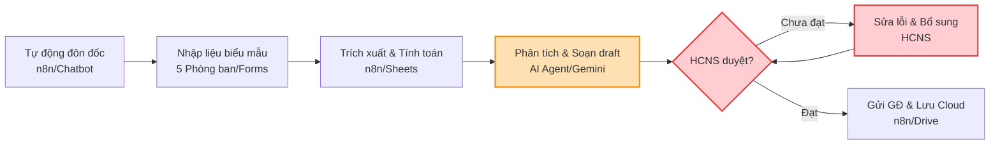
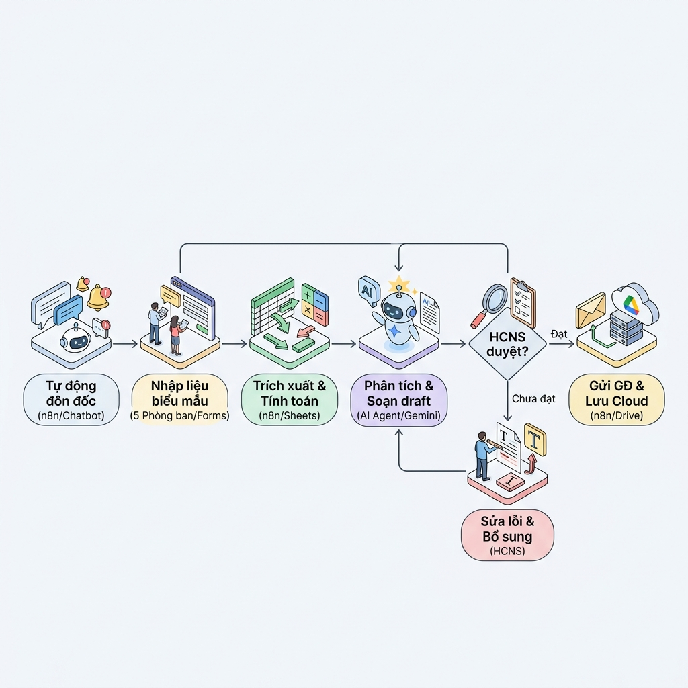
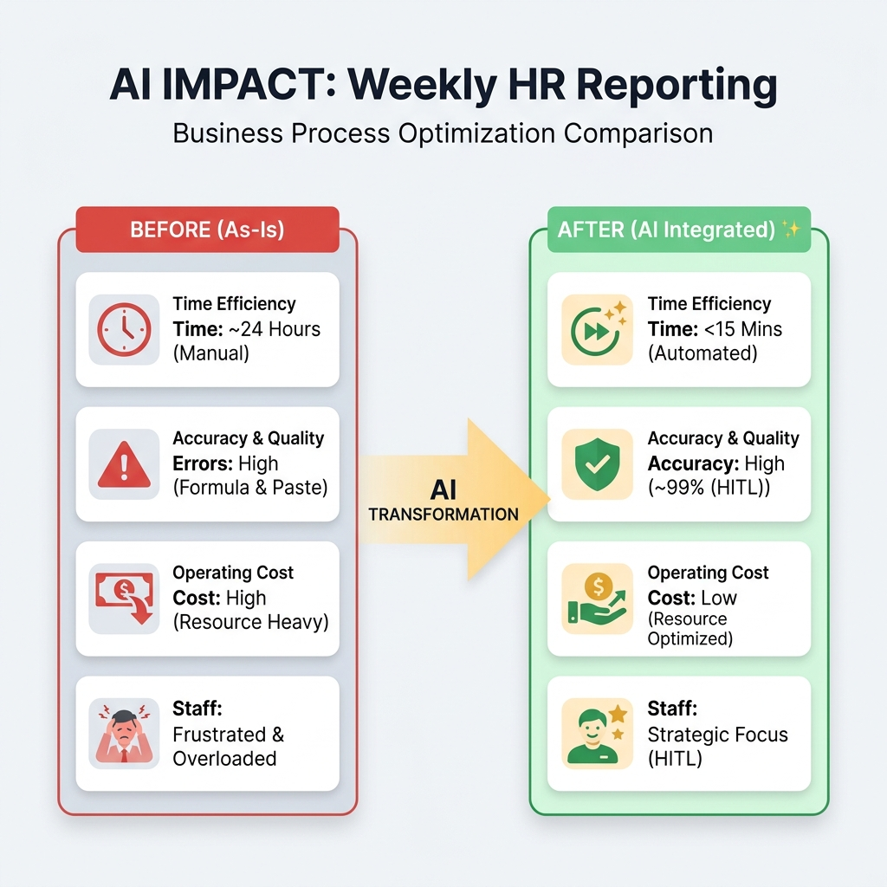
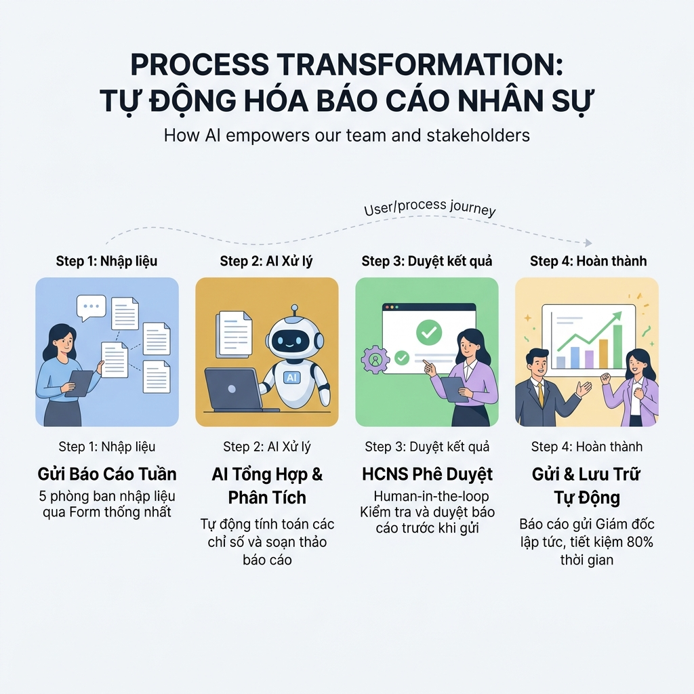

* ```
  mo-ta: Quy trình as-is và to-be của việc tổng hợp báo cáo nhân sự hằng tuần (phiên bản chuyển đổi theo template)
  trang-thai: active
  phien-ban: v1.0
  created-at: 2026-06-21 21:50 +07:00
  updated-at: 2026-06-21 21:50 +07:00
  ```

# Workflow design doc — Tổng hợp báo cáo nhân sự hằng tuần

Tài liệu thiết kế quy trình này giúp nhóm mô tả rõ ràng từ hiện trạng thủ công (as-is) cho đến quy trình mới được tối ưu hóa bằng AI (to-be) và các bước chuẩn bị tự động hóa.

## 1. Hiện trạng (as-is)

*Bảng mô tả các bước thực hiện thủ công hiện tại:*

| Bước | Người thực hiện | Công cụ đang dùng | Điểm nghẽn                                                 | Lỗi lặp                                                    |
| :----- | :------------------ | :-------------------- | :------------------------------------------------------------ | :----------------------------------------------------------- |
| 1      | Nhân viên HCNS    | Zalo / Email          | Đôn đốc thủ công từng phòng                           | Dễ quên nhắc nhở dẫn đến nộp trễ báo cáo          |
| 2      | 5 phòng ban        | Word / Excel          | Định dạng báo cáo không đồng nhất (khác cấu trúc) | Dữ liệu gửi về lộn xộn, khó chuẩn hóa               |
| 3      | Nhân viên HCNS    | Excel                 | Phải mở từng file và copy-paste số liệu thủ công      | Tốn thời gian, dễ copy-paste sai lệch dữ liệu          |
| 4      | Nhân viên HCNS    | Excel                 | Tính toán thủ công các cột tổng hợp                   | Lỗi công thức hoặc tính nhầm số liệu biến động    |
| 5      | Nhân viên HCNS    | Excel / Word          | Vẽ biểu đồ, chụp ảnh rồi dán thủ công sang Word     | Định dạng biểu đồ không chuẩn, giao diện lệch lạc |
| 6      | Nhân viên HCNS    | Email                 | Soạn email và đính kèm file gửi Giám đốc thủ công  | Dễ quên đính kèm file hoặc viết sai nội dung email   |
| 7      | Nhân viên HCNS    | Máy tính cục bộ   | Lưu trữ thủ công vào thư mục máy tính                | Quy tắc đặt tên file lộn xộn, khó tìm kiếm lại     |

## 2. Phân tích ESIA & Đề xuất quy trình mới (to-be)

*Áp dụng khung ESIA để lựa chọn thao tác tối ưu (E - Eliminate, S - Simplify, I - Integrate, A - Automate):*

| Bước | Hành động (E/S/I/A) | Chi tiết tối ưu hóa & Thiết kế điểm duyệt (HITL: Human-in-the-loop)                                                                                                                    |
| :----- | :--------------------- | :---------------------------------------------------------------------------------------------------------------------------------------------------------------------------------------------- |
| 1      | E / A                  | **Eliminate & Automate**: Loại bỏ nhắn tin thủ công. Tự động gửi thông báo đôn đốc 5 phòng định kỳ qua Chatbot (Zalo/Telegram) hoặc Email.                            |
| 2      | S / I                  | **Simplify & Integrate**: Thiết lập một biểu mẫu nhập liệu (Google Forms/Sheets) đồng nhất cho cả 5 phòng để dữ liệu tự động đổ về một nguồn tập trung.          |
| 3      | A                      | **Automate**: Hệ thống tự động trích xuất dữ liệu từ nguồn tập trung bằng n8n workflow ngay khi có dữ liệu mới.                                                          |
| 4      | A                      | **Automate**: Tự động tính toán các chỉ số nhân sự (biến động, tuyển mới, nghỉ việc) qua script/n8n.                                                                     |
| 5      | A                      | **Automate**: AI Agent tự động phân tích dữ liệu, vẽ biểu đồ và xuất báo cáo PDF/Word chuẩn hóa.                                                                         |
| 6      | A                      | **Automate (HITL)**: Nhân viên HCNS kiểm tra lại báo cáo đã tạo. Sau khi xác nhận (Human-in-the-loop), hệ thống tự động gửi email đính kèm báo cáo cho Giám đốc. |
| 7      | A                      | **Automate**: Hệ thống tự động lưu file lên cloud storage (Google Drive/OneDrive) và đặt tên theo định dạng chuẩn hóa (`[Bao-cao-nhan-su-tuan]-YYYY-MM-DD`).            |

## 3. Sơ đồ quy trình mới (Mermaid)

*Mã Mermaid flowchart mô tả quy trình to-be:*



## 4. Ảnh render workflow



## 5. Sơ đồ so sánh Trước & Sau (Before & After)



## 6. Ảnh kể chuyện quy trình (Storytelling Infographic)



## 7. Danh sách bước cần tự động hóa

*Liệt kê các bước được đánh dấu **A (Automate)** và ghi rõ yêu cầu kiểm soát chất lượng:*

1. **Bước 1: Tự động đôn đốc**:

   - Công cụ dự kiến: n8n workflow kết hợp Telegram/Zalo API hoặc Gmail.
   - Điểm duyệt con người: Không. Hệ thống tự động gửi định kỳ vào 9h sáng thứ Sáu hằng tuần.
   - Phương án dự phòng khi AI lỗi: Báo lỗi qua webhook về kênh admin. Nhân viên HCNS sẽ gửi tin nhắn thủ công.
2. **Bước 3 & 4: Tự động trích xuất và tính toán dữ liệu**:

   - Công cụ dự kiến: n8n workflow và Google Sheets.
   - Điểm duyệt con người: Không. Dữ liệu được trích xuất tự động qua API.
   - Phương án dự phòng khi AI lỗi: Nhân viên HCNS mở trực tiếp file Google Sheets để tổng hợp tay.
3. **Bước 5: Tự động tạo biểu đồ và sinh báo cáo**:

   - Công cụ dự kiến: AI Agent (n8n + LLM API như Gemini/OpenAI) để phân tích định tính và tạo báo cáo trực quan.
   - Điểm duyệt con người: Có. Nhân viên HCNS phải kiểm tra và xác nhận nội dung báo cáo xem đã hợp lý chưa.
   - Phương án dự phòng khi AI lỗi: Tạo file báo cáo thô không chứa nhận xét để HCNS bổ sung nhận xét thủ công.
4. **Bước 6 & 7: Tự động gửi email và lưu trữ**:

   - Công cụ dự kiến: n8n workflow kết hợp Gmail API và Google Drive API.
   - Điểm duyệt con người: Có (HITL). Báo cáo chỉ được gửi sau khi HCNS nhấn nút duyệt (approve) trên giao diện admin/chatbot.
   - Phương án dự phòng khi AI lỗi: Nhân viên HCNS tải file báo cáo đã duyệt về máy và gửi email thủ công.
