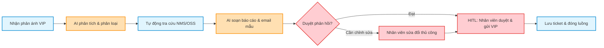
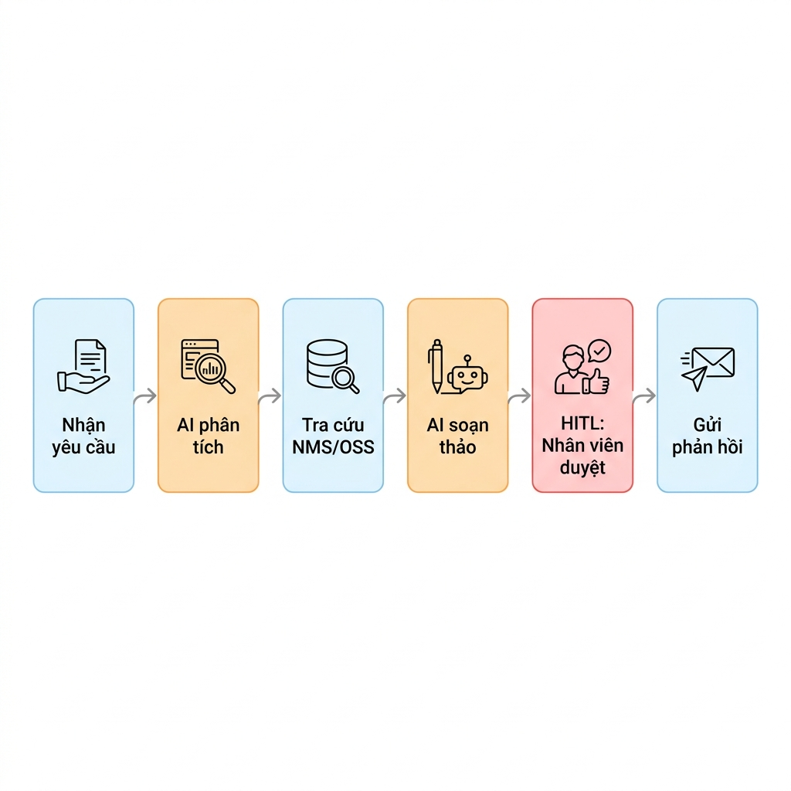
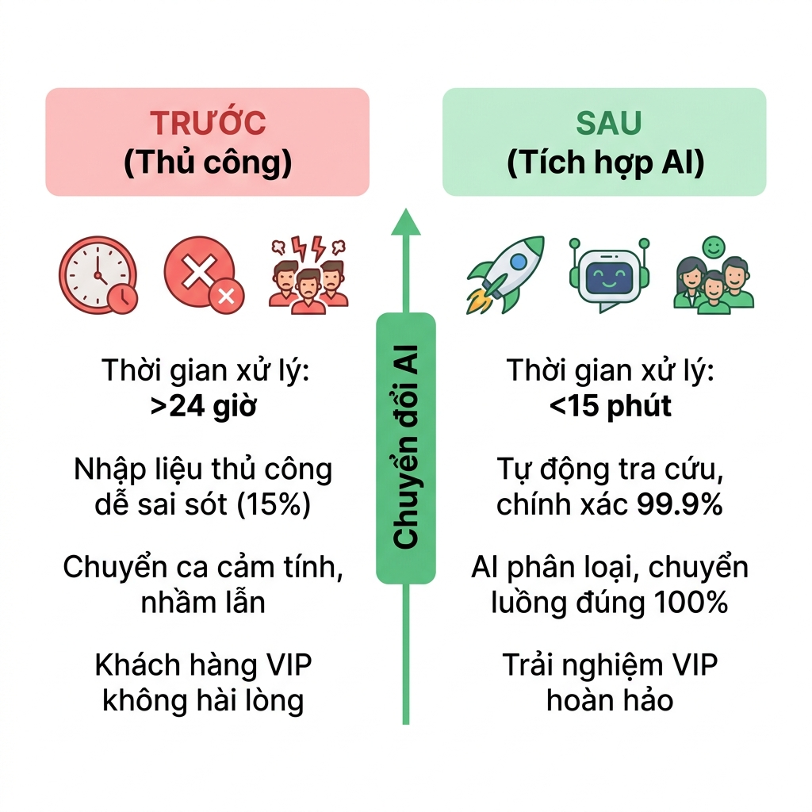

# Workflow design doc — xử lý phản ánh chất lượng mạng khách hàng VIP

Tài liệu thiết kế quy trình này giúp nhóm mô tả rõ ràng từ hiện trạng thủ công (as-is) cho đến quy trình mới được tối ưu hóa bằng AI (to-be) và các bước chuẩn bị tự động hóa.

## 1. Hiện trạng (as-is)

*Bảng mô tả các bước thực hiện thủ công hiện tại:*

| Bước | Người thực hiện | Công cụ đang dùng | Điểm nghẽn | Lỗi lặp |
| :--- | :--- | :--- | :--- | :--- |
| 1 | Điện thoại viên trực Hotline VIP | CRM / Ticket system | Phải nhập tay lại thông tin nếu phản ánh gửi qua email hoặc chat, tốn thời gian. | Nhập thiếu thông tin liên hệ hoặc tọa độ trạm phát sóng bị ảnh hưởng. |
| 2 | Trưởng ca Hotline VIP | Excel, Email nội bộ | Phân loại mức độ nghiêm trọng theo cảm tính, chuyển nhầm luồng kỹ thuật gây kéo dài thời gian. | Nhầm lẫn giữa các phòng ban kỹ thuật chuyên sâu (NOC, Vô tuyến, Truyền dẫn). |
| 3 | Kỹ sư mạng lưới (NOC) | Hệ thống giám sát mạng (NMS), OSS | Đăng nhập nhiều hệ thống khác nhau, copy-paste số thuê bao để tra cứu chéo thủ công. | Copy nhầm số thuê bao hoặc chọn sai dải IP thiết bị. |
| 4 | Kỹ sư mạng lưới (NOC) | Word, Email | Soạn báo cáo kỹ thuật phức tạp bằng tiếng Việt/tiếng Anh, mất thời gian giải thích cho người không chuyên. | Dùng quá nhiều thuật ngữ chuyên môn sâu khiến CSKH khó giải thích lại cho khách hàng. |
| 5 | Nhân viên chăm sóc khách hàng VIP | Email, Điện thoại | Chờ phản hồi từ kỹ thuật lâu, tự biên tập lại email phản hồi cho trang trọng, tốn nhiều thời gian. | Văn phong phản hồi thiếu thống nhất, không đảm bảo tiêu chuẩn dịch vụ VIP. |

## 2. Phân tích ESIA & đề xuất quy trình mới (to-be)

*Áp dụng khung ESIA để lựa chọn thao tác tối ưu (E - Eliminate, S - Simplify, I - Integrate, A - Automate):*

| Bước | Hành động (E/S/I/A) | Chi tiết tối ưu hóa & Thiết kế điểm duyệt (HITL: Human-in-the-loop) |
| :--- | :--- | :--- |
| 1 | **I — Integrate** | Tích hợp n8n để tự động thu thập phản ánh từ mọi kênh (email, chat, hotline) về một giao diện tập trung. |
| 2 | **A — Automate** | Sử dụng AI (Large Language Model) để trích xuất thông tin tự động và phân loại mức độ khẩn cấp theo bộ quy tắc chuẩn. |
| 3 | **S — Simplify** | Gọi API tự động kết nối NMS/OSS tra cứu chất lượng mạng dựa trên số thuê bao và tọa độ trạm, bỏ qua bước đăng nhập thủ công. |
| 4 | **A — Automate** | Sử dụng AI tổng hợp log kỹ thuật thành tóm tắt ngôn ngữ tự nhiên dễ hiểu và soạn thảo sẵn email phản hồi chuẩn VIP. |
| 5 | **A — Automate** với **HITL** | **HITL:** Nhân viên chăm sóc khách hàng VIP bắt buộc phải kiểm duyệt, chỉnh sửa (nếu cần) và bấm phê duyệt email phản hồi trước khi gửi cho khách hàng. |

## 3. Sơ đồ quy trình mới (mermaid)

*Mã Mermaid flowchart mô tả quy trình to-be:*

## 4. Ảnh render workflow

## 5. Sơ đồ so sánh trước & sau (before & after)

## 6. Danh sách bước cần tự động hóa

*Danh sách các bước được đánh dấu **A (Automate)** và yêu cầu kiểm soát chất lượng:*

1. **Bước 2: AI phân tích & phân loại yêu cầu**:
   - Công cụ dự kiến: n8n kết hợp với OpenAI gpt-5.5 / Gemini 3.5 Flash để trích xuất thực thể (số điện thoại, lỗi, khu vực) và gán nhãn độ khẩn cấp.
   - Điểm duyệt con người: Không cần duyệt chặn trực tiếp ở bước này, nhưng hệ thống sẽ gửi cảnh báo đến trưởng ca nếu phát hiện từ khóa cực kỳ khẩn cấp (vd: "rớt mạng diện rộng", "cháy nổ").
   - Phương án dự phòng khi AI lỗi: Nếu AI không phân loại được (độ tin cậy dưới 70%), ticket sẽ tự động chuyển sang luồng phân loại thủ công của trưởng ca Hotline VIP.

2. **Bước 4: AI soạn báo cáo kỹ thuật & email mẫu**:
   - Công cụ dự kiến: n8n tích hợp LLM để xử lý dữ liệu log kỹ thuật từ NMS và kết hợp với ngữ cảnh khiếu nại để soạn email phản hồi chuẩn VIP.
   - Điểm duyệt con người: **HITL bắt buộc.** Nhân viên chăm sóc khách hàng VIP phải kiểm tra và xác nhận nội dung email trước khi gửi.
   - Phương án dự phòng khi AI lỗi: Dừng luồng tự động và tạo ticket yêu cầu nhân viên NOC phối hợp soạn email phản hồi thủ công.

---
**Tuyên bố tuân thủ (Compliance Statement):**
Theo Luật Trí tuệ nhân tạo (TTNT) số 134/2025/QH15, bước 5 (gửi phản hồi cho khách hàng VIP) bắt buộc áp dụng cơ chế con người duyệt (Human-in-the-loop - HITL) nhằm kiểm soát chất lượng phản hồi, bảo vệ thông tin cá nhân và đảm bảo uy tín chất lượng dịch vụ của doanh nghiệp. Các bước tiền xử lý như phân loại (bước 2) và soạn thảo bản nháp (bước 4) không cần phê duyệt chặn do có mức độ rủi ro thấp và luôn được kiểm soát ở bước duyệt cuối cùng.
