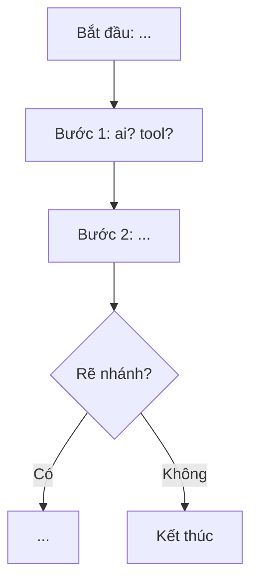

# Checkpoint S2-A — Sơ đồ as-is (Mermaid) chạy

> **Dùng khi:** Mermaid lỗi cú pháp / sơ đồ hiện trạng rối.

## Trạng thái kỳ vọng

- 1 sơ đồ **as-is** (hiện trạng) bằng Mermaid, render được (mermaid.live hoặc Antigravity).
- Rõ ≥5 bước: ai làm gì → công cụ → đầu ra.

## Template Mermaid

## Cấp cứu nhanh

- **Mermaid không render:** dán vào mermaid.live xem lỗi cú pháp; kiểm ngoặc/`-->`/node id trùng.
- **Sơ đồ rối:** chia thành swimlane (theo vai trò) hoặc tách subgraph.
- **Backup:** TA vẽ nhanh as-is trên bảng/tinderbox → HV dịch sang Mermaid.

> Kế thừa: `reference/agribank-workflow/` (ESIA + Mermaid mẫu).
