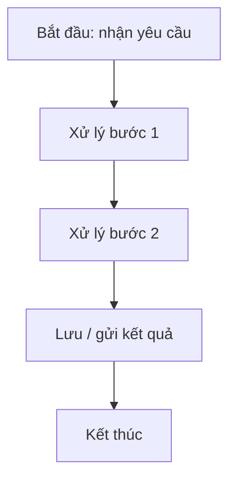
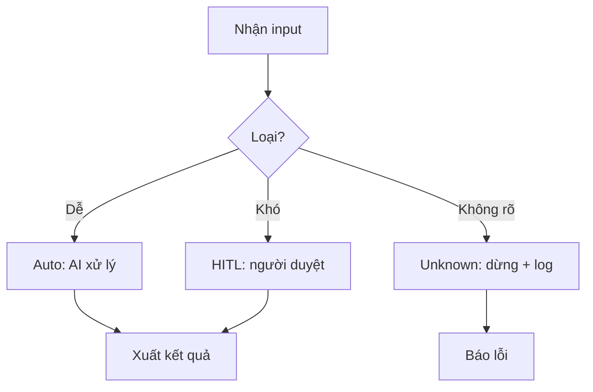
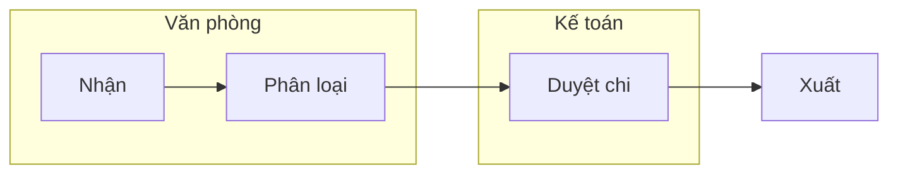

# Mermaid Starter — Template sơ đồ workflow cho non-tech

> Dùng khi HV yếu Mermaid (F4). Copy template gần nhất → điền → dán vào mermaid.live hoặc Antigravity.

## 1. Tuyến tính (as-is đơn giản nhất)

## 2. Có rẽ nhánh (to-be có AI/tự động)

## 3. Theo vai trò (swimlane)

## Lỗi cú pháp thường gặp

| Lỗi | Sửa |
|---|---|
| Node id trùng | mỗi id duy nhất (A, B, C...) |
| Nhãn có ký tự đặc biệt | bọc `[...]` hoặc `(...)` |
| `-->` viết thành `->` | phải `-->` (2 dấu) |
| Subgraph thiếu `end` | mỗi `subgraph` cần 1 `end` |

> Mẹo: dán vào **mermaid.live** xem lỗi ngay; sửa đến khi render.
