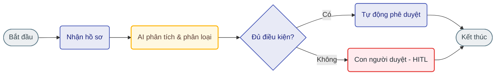

# Prompt xuất ảnh sơ đồ quy trình dạng infographic (Render Mermaid)

Hãy sao chép toàn bộ nội dung dưới đây, dán mã Mermaid của nhóm bạn vào phần cuối, rồi gửi cho **Codex** hoặc **Nano Banana (Gemini)** để kết xuất (render) thành ảnh sơ đồ quy trình dạng infographic chất lượng cao.

```text
Prompt:
"A professional, modern horizontal business process infographic diagram presented on a clean, light gray background (#F8FAFC). The design uses crisp, clean technical line-art with subtle color fills (modern pastel palette) and a distinct isometric 3D perspective for icons]

Layout & Structure:
The infographic must visualize the provided Mermaidjs flowchart using a horizontal layout running strictly from left to right. The entire flowchart is segmented by thin, elegant vertical divider lines separating the major process steps derived from the Mermaid source. Connectors are thin, sharp dark gray arrows with smooth right-angle bends connecting the stages cleanly, with precise directionality.
Node Styles & Illustrations (Dynamic based on Mermaid Input):
Each node from the Mermaid chart is represented by a stylized rounded box or capsule (using the pastel palette) containing the node label. Below and above each box, detailed isometric 3D illustrations visualize the specific step. For example, a "Remind" step will show modern laptops with floating notification bell icons; "Submit" will show miniature isometric characters at office desks submitting data into a floating digital form dashboard; and a "Decision" diamond will show a character, such as an HR manager, inspecting papers with a magnifying glass. Standard flow control nodes like "Start" and "End" must include distinct icons (e.g., a clock/calendar, a green checkmark badge/finish flag).
Branching (Based on Mermaid Input):
Branching lines (e.g., for decision diamonds like "HITL") must point in the appropriate direction ("up" for negative/backwards flows, "forward" for positive flows) and connect to the correct destination nodes, including looping back when necessary.
Typography & Text Requirements:
All text and labels inside the boxes must be written exactly in a clear, modern sans-serif typeface (like Inter, Segoe UI, or Roboto) with high contrast text. There must be absolutely no overlapping elements, clean alignment, crisp 8k resolution, and an ultra-detailed diagramming style. All text must be in Vietnamese, precisely matching the labels from the provided Mermaid source, without any spelling errors or incorrect translations.
Output:

A high-resolution, sharp PNG image file."
2. Yêu cầu hiển thị:
- Sử dụng font chữ sans-serif hiện đại (như Inter, Segoe UI, hoặc Roboto), nét chữ thanh mảnh nhưng rõ ràng, dễ đọc.
- Đảm bảo hiển thị chính xác toàn bộ nội dung văn bản tiếng Việt từ mã Mermaid, không tự ý viết sai chính tả hoặc dịch nghĩa sai lệch.
- Xuất ra tệp ảnh định dạng PNG độ phân giải cao, sắc nét, nền xám nhạt mịn (#F8FAFC).

Dưới đây là mã nguồn Mermaid của tôi:
```


