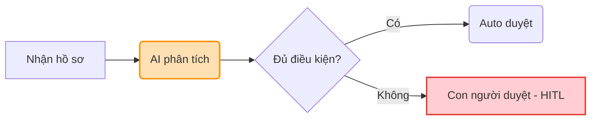

# Prompt xuất ảnh sơ đồ quy trình (Render Mermaid)

Hãy sao chép toàn bộ nội dung dưới đây, dán mã Mermaid của nhóm bạn vào phần cuối, rồi gửi cho **Codex** hoặc **Nano Banana (Gemini)** để kết xuất (render) thành ảnh sơ đồ quy trình dạng PNG chất lượng cao.

```text
Hãy kết xuất (render) sơ đồ Mermaid sau đây thành một tệp ảnh PNG nằm ngang, phong cách thiết kế tối giản và hiện đại (style sạch, font dễ đọc, kích thước chữ 14px):
- Sử dụng màu cam nhạt (fill: #FFE0B2) cho các nút có nhãn AI (aiNode).
- Sử dụng màu đỏ nhạt (fill: #FFCDD2) cho các nút có nhãn điểm duyệt con người (hitlNode).
- Sử dụng màu xanh dương nhạt (fill: #E3F2FD) cho các nút tác vụ thông thường.
- Đảm bảo khoảng cách giữa các nút rộng rãi, không bị chồng chéo chữ hoặc nhãn đè lên nhau.

Dưới đây là mã nguồn Mermaid của tôi:
[DÁN MÃ MERMAID CỦA BẠN VÀO ĐÂY, VÍ DỤ:]
```

