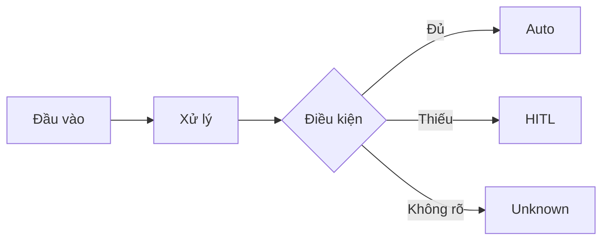

# Workflow design doc — [Tên quy trình]

Tài liệu thiết kế quy trình này giúp nhóm mô tả rõ ràng từ hiện trạng thủ công (as-is) cho đến quy trình mới được tối ưu hóa bằng AI (to-be) và các bước chuẩn bị tự động hóa.

## 1. Hiện trạng (as-is)

*Điền bảng mô tả các bước thực hiện thủ công hiện tại:*

| Bước | Người thực hiện | Công cụ đang dùng | Điểm nghẽn | Lỗi lặp |
| :--- | :--- | :--- | :--- | :--- |
| 1 | | | | |
| 2 | | | | |
| 3 | | | | |
| 4 | | | | |
| 5 | | | | |

## 2. Phân tích ESIA & Đề xuất quy trình mới (to-be)

*Áp dụng khung ESIA để lựa chọn thao tác tối ưu (E - Eliminate, S - Simplify, I - Integrate, A - Automate):*

| Bước | Hành động (E/S/I/A) | Chi tiết tối ưu hóa & Thiết kế điểm duyệt (HITL: Human-in-the-loop) |
| :--- | :--- | :--- |
| 1 | | |
| 2 | | |
| 3 | | |
| 4 | | |
| 5 | | |

## 3. Sơ đồ quy trình mới (Mermaid)

*Dán mã Mermaid flowchart mô tả quy trình to-be vào đây:*

## 4. Ảnh render workflow

*(Xuất ảnh sơ đồ từ mermaid.live hoặc render bằng AI rồi chèn vào đây)*

## 5. Sơ đồ so sánh Trước & Sau (Before & After)

*(Chèn ảnh infographic so sánh hiệu quả Trước & Sau khi áp dụng AI)*

## 6. Danh sách bước cần tự động hóa

*Liệt kê các bước được đánh dấu **A (Automate)** và ghi rõ yêu cầu kiểm soát chất lượng:*

1. **Bước [Tên bước]**:
   - Công cụ dự kiến: [ví dụ: n8n, AI Agent...]
   - Điểm duyệt con người: [Có/Không. Nếu có, ai duyệt và duyệt ở đâu?]
   - Phương án dự phòng khi AI lỗi: [ví dụ: dừng luồng và báo qua Chatbot cho quản trị viên]
