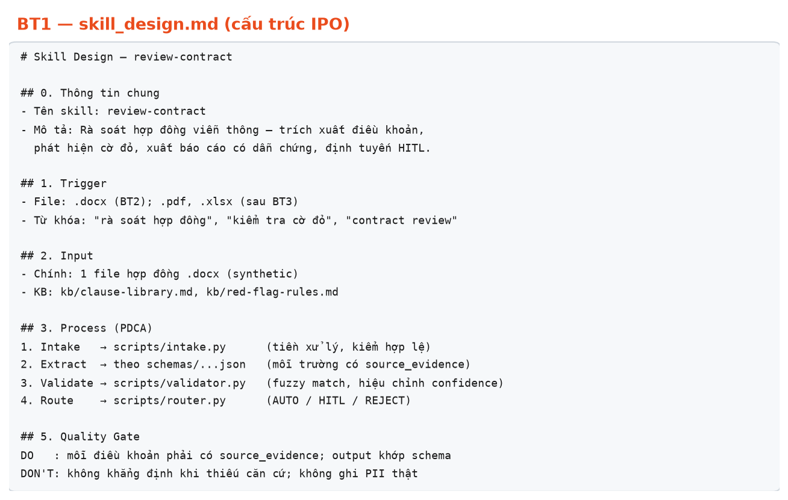
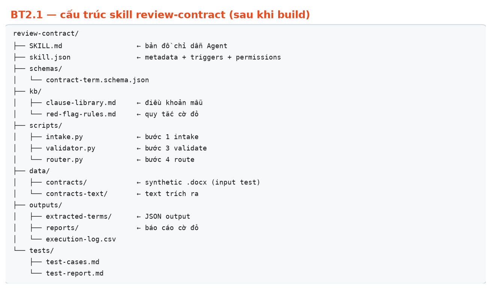
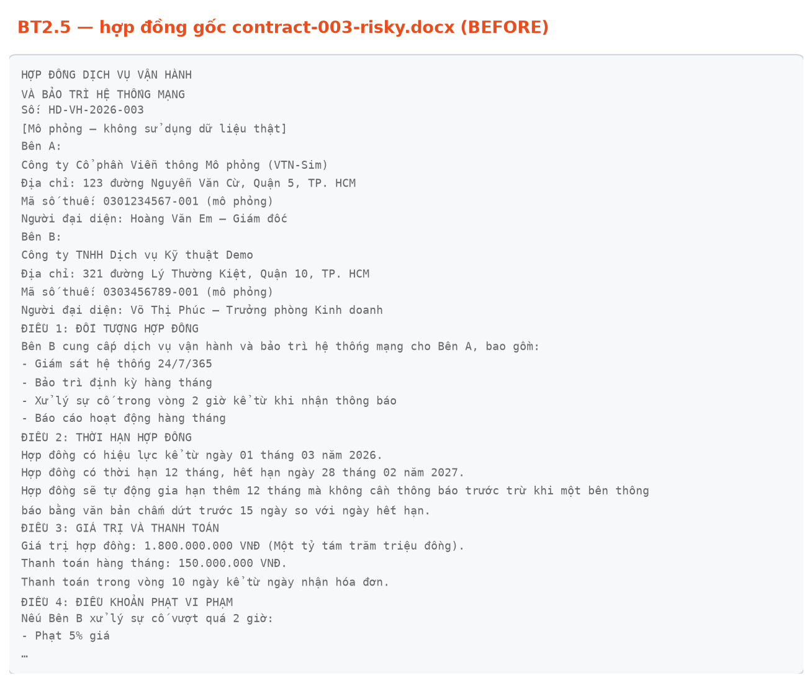
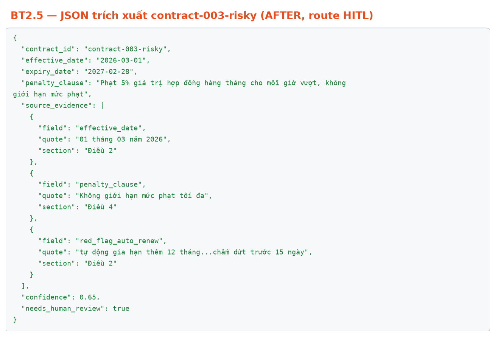
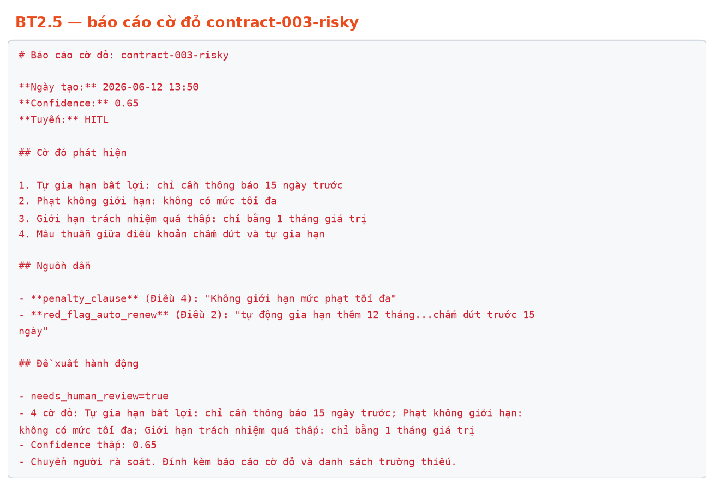
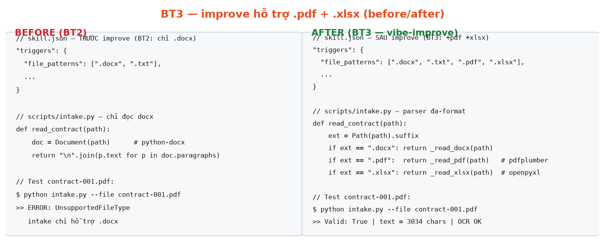
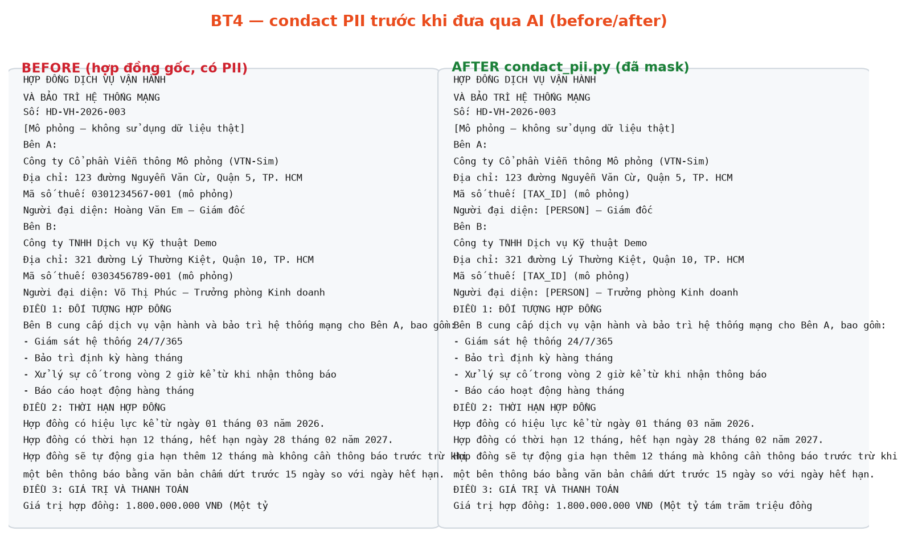

# Track A — Hướng dẫn thực hành session 05 (vibe-working): build skill `review-contract` qua 4 bài

> [!NOTE]
> **Chọn track nào?** Có 2 lối vào cùng chủ đề "AI Agent review hợp đồng":
> - **Track A — Vibe Working** (file này): dùng skill `vibe-aiworkforce` + `vibe-improve` để **thiết kế → generate → improve** skill. Phù hợp HV muốn học workflow thời AI, ít viết code tay.
> - **Track B — Làm tay** ([lab-handbuilt.md](lab-handbuilt.md)): tự viết từng file SKILL.md/skill.json/schemas/scripts. Phù hợp HV muốn hiểu sâu "ruột" một skill.
>
> Track A hiện thực hóa trực tiếp slide lý thuyết (Skill ≈ App, PDCA, vibe-aiworkforce build skill). Mở rộng: [addendum S5](../../01-slides/designs/session-05-addendum-vibe-skill-workforce.md).

> [!NOTE]
> **Minh họa trong lab này:** các ảnh ở từng bài là **kết quả thật** từ một lượt dry-run pipeline xử lý hợp đồng (chạy `intake.py`/`validator.py`/`router.py`/`condact_pii.py` trên synthetic contracts). HV dùng Antigravity sẽ có UI khác nhưng **kết quả đầu ra giống hệt** (cùng skill, cùng scripts).

## 1. Mục tiêu bài thực hành

Học viên đi qua **đầy đủ vòng đời một skill** theo workflow vibe-working, không tự code tay:

- **BT1 — Design:** viết `skill_design.md` theo cấu trúc **IPO** (Input–Process–Output), đủ Trigger / Quality Gate / HITL / folder structure. Đây là "bản vẽ" trước khi build.
- **BT2 — Generate + Package + Install + Test:** dùng `vibe-aiworkforce` để sinh skill `review-contract` từ `skill_design.md` → đóng gói ZIP bằng `vibe-packaging-orchestrator` → cài vào Antigravity/Codex/Claude → test trên synthetic contracts.
- **BT3 — Improve:** dùng `vibe-improve-orchestrator` để skill nhận thêm `.pdf` + `.xlsx` (không chỉ `.docx`). Nắm 7-phase pipeline + cách improve có verify.
- **BT4 — Nâng cao:** bổ sung **red-flag library** + bước **condact PII** trước khi đưa qua AI.

> **Chuỗi móc nối:** output BT1 (`skill_design.md`) = input BT2 → skill sinh ra = input BT3 → skill improved = input BT4. Cùng một skill, lớn dần qua 4 bài.

## 2. Bối cảnh tình huống

Bạn là thành viên đội pháp lý của một doanh nghiệp viễn thông. Mỗi tháng đội rà soát hàng chục hợp đồng dịch vụ, mua thiết bị, lao động. Hiện rà soát thủ công, dễ bỏ sót điều khoản rủi ro.

Thay vì tự code một tool, bạn đóng gói quy trình thành một **skill tên `review-contract`** — một "nhân viên số" cài đặt được (giống App), chạy được, nâng cấp được. Khi cần rà soát, chỉ cần gửi file cho Agent; skill tự tiếp nhận → trích xuất → tự kiểm → phát hiện cờ đỏ → xuất báo cáo, và chuyển người duyệt khi rủi ro cao.

> [!IMPORTANT]
> **NGUYÊN TẮC CỐT LÕI:** Skill chỉ kết luận dựa trên nội dung có trong hợp đồng hoặc kho tri thức. Thiếu căn cứ, mâu thuẫn, rủi ro cao → chuyển con người trong vòng lặp (HITL). Tuyệt đối không khẳng định suông.

## 3. Quy tắc an toàn bắt buộc

- Chỉ dùng dữ liệu mô phỏng trong [synthetic-data/](synthetic-data/).
- Không dùng hợp đồng thật, tên đối tác thật, MST/PII thật, số tiền thương mại thật.
- Không đưa token, API key, mật khẩu vào bài nộp.
- Skill `vibe-aiworkforce` / `vibe-improve` (cài sẵn ở [skills/](skills/)) chỉ chạy local; không gọi mạng ngoài.

## 4. Dữ liệu & công cụ sử dụng

**Synthetic contracts** ([synthetic-data/contracts/](synthetic-data/contracts/)):

| Tệp | Đặc điểm | Dùng ở |
| --- | --- | --- |
| `contract-001.docx` | đầy đủ, bình thường | BT2 |
| `contract-002.docx` | thiếu trường, lỗi OCR | BT2 |
| `contract-003-risky.docx` | 3 cờ đỏ rõ | BT2, BT4 |
| `contract-004-telecom-sla.docx` | SLA 99.99% | BT2 |
| `contract-001.pdf` | biến thể PDF của 001 | BT3 |
| `contract-005-spreadsheet.xlsx` | hợp đồng dạng bảng | BT3 |

**Skills cài sẵn** ([skills/](skills/)) — cài vào Antigravity/Codex/Claude trước khi làm:

- `vibe-aiworkforce.zip` — build skill từ `skill_design.md`.
- `vibe-improve-orchestrator.zip` — improve skill đã có (7-phase, có verify).

> Hướng dẫn cài: xem [skills/README.md](skills/README.md).

## 5. Cấu trúc thời gian gợi ý

| Bài | Thời lượng | Đầu ra học viên mang về |
| --- | ---: | --- |
| BT1 — Design (IPO) | 30 phút | `skill_design.md` hoàn chỉnh |
| BT2 — Generate + Package + Install + Test | 60 phút | `review-contract.zip` + test pass ≥ 3/4 ca |
| BT3 — Improve multi-format | 45 phút | `review-contract` chạy được `.pdf` + `.xlsx` |
| BT4 — Năng cao (red-flag + PII) | 30+ phút (stretch) | red-flag library + script condact PII |

> Nếu thiếu thời gian: làm BT1→BT3, BT4 làm về nhà.

---

## 6. BT1 — Viết `skill_design.md` theo cấu trúc IPO

> **Mỏ neo slide:** Skill ≈ App · cấu trúc Skill Package · Trigger (addendum A10–A13).

### Mục tiêu
Mô tả skill `review-contract` **trước khi build** — đủ chi tiết để BT2 một skill builder (`vibe-aiworkforce`) đọc và sinh ra gói skill mà không cần hỏi lại.

### Hai đường (chọn 1)

**Đường 1 — làm tay từ template:**
1. Copy [templates/skill-design/skill_design.md](templates/skill-design/skill_design.md) → folder làm việc của bạn, đặt tên `skill_design.md`.
2. Điền từng mục `<...>` cho skill `review-contract` (dùng bối cảnh §2 làm gợi ý).

**Đường 2 — dùng prompt generate:**
1. Mở [templates/skill-design/generate_skill_design.md](templates/skill-design/generate_skill_design.md).
2. Copy prompt → dán vào Antigravity/Codex/Claude, thay `<MÔ TẢ TASK>` bằng: *"Rà soát hợp đồng viễn thông: đọc .docx, trích xuất điều khoản (ngày hiệu lực, SLA, phạt, gia hạn), phát hiện cờ đỏ, xuất JSON có dẫn chứng, chuyển người duyệt khi rủi ro cao."*
3. AI trả ra `skill_design.md` → bạn đọc lại, sửa cho hợp thực tế đội mình.

### Bắt buộc có trong `skill_design.md`
- [ ] Trigger cụ thể (loại file + từ khóa + ngữ cảnh)
- [ ] Input rõ (dữ liệu chính + knowledge base + điều kiện hợp lệ + dữ liệu cấm)
- [ ] Process 4 bước (intake → extract → validate → route) + scripts gọi + phân vai AI vs code
- [ ] Output: file + schema (liệt kê trường) + trạng thái kết thúc
- [ ] Quality Gate: Do (≥3) + Don't (≥3)
- [ ] HITL: khi nào chuyển người duyệt, AI vs Human
- [ ] Section cấu trúc folder (SKILL.md, skill.json, schemas/, kb/, scripts/, data/, outputs/, tests/)

### Đầu ra
1 file `skill_design.md` hoàn chỉnh trong folder làm việc của bạn.

📸 **Minh họa kết quả BT1** — cấu trúc IPO của `skill_design.md`:

> [!TIP]
> **Kẹt?** Đối chiếu đáp án tham khảo: [templates/skill-design/skill_design.review-contract.example.md](templates/skill-design/skill_design.review-contract.example.md). Đừng copy nguyên văn — hiểu rồi viết lại theo ý mình.

---

## 7. BT2 — Generate + Package + Install + Test

> **Mỏ neo slide:** vibe-aiworkforce build skill (A14 Skill-build-Skill) · Skill ≈ App (cài đặt + chạy) · PDCA pha Do.

### Mục tiêu
Biến `skill_design.md` (BT1) thành một gói skill **cài đặt được** (ZIP), cài vào super agent, và chạy test trên synthetic contracts.

### Bước BT2.1 — Build skill bằng `vibe-aiworkforce`

1. Đảm bảo `vibe-aiworkforce` đã cài (xem [skills/README.md](skills/README.md)).
2. Mở Antigravity/Codex/Claude Code tại folder làm việc của bạn (folder chứa `skill_design.md`).
3. Yêu cầu AI build:
   > "Dùng skill vibe-aiworkforce để build skill `review-contract` từ file `skill_design.md` ở folder này. COMPANY_ROOT = `<folder làm việc của bạn>`."
4. `vibe-aiworkforce` sinh ra thư mục `review-contract/` (SKILL.md, skill.json, schemas/, kb/, scripts/, …) theo đúng cấu trúc đã mô tả trong `skill_design.md` §7.

> **Lưu ý:** `vibe-aiworkforce` yêu cầu `COMPANY_ROOT` — đặt bằng folder làm việc của bạn để skill lưu đúng chỗ và share được.

### Bước BT2.2 — Kiểm nhanh cấu trúc skill sinh ra

- [ ] Có `SKILL.md`, `skill.json`
- [ ] `schemas/contract-term.schema.json` tồn tại
- [ ] `kb/clause-library.md`, `kb/red-flag-rules.md` tồn tại
- [ ] `scripts/intake.py`, `validator.py`, `router.py` tồn tại
- [ ] `skill.json` có `triggers` + `permissions` (read only data/, write outputs/, no network)

> Cấu trúc kỳ vọng giống [outputs/contract-term-extractor/](outputs/contract-term-extractor/) (đã có sẵn làm tham chiếu "expected result").

📸 **Minh họa kết quả BT2.1** — cấu trúc thư mục skill `review-contract` sau khi `vibe-aiworkforce` sinh ra:

### Bước BT2.3 — Đóng gói ZIP bằng `vibe-packaging-orchestrator`

1. Yêu cầu AI:
   > "Dùng skill vibe-packaging-orchestrator để đóng gói skill `review-contract` thành file ZIP sẵn cài."
2. Kết quả: `review-contract.zip` (install-ready — unzip là chạy, đã sanitize thông tin cá nhân, đã validate cấu trúc).

### Bước BT2.4 — Cài vào super agent

- **Antigravity:** kéo thả `review-contract.zip` vào ô chat và gõ câu lệnh: *"cài đặt skill này vào project hiện tại để sử dụng lại trong các lần sau"*.
- **Claude Code:** giải nén vào `~/.claude/skills/review-contract/`.
- **Codex:** theo hướng dẫn cài skill của Codex.
- Verify: hỏi super agent *"Bạn có skill review-contract không?"* → phải trả lời có.

### Bước BT2.5 — Test trên 3 synthetic contracts

Gửi từng file cho skill (đặt synthetic contracts vào `review-contract/data/contracts/`):

| Ca | File | Kỳ vọng |
|----|------|---------|
| 1 | `contract-001.docx` | `auto_pass`, đủ trường, có evidence |
| 2 | `contract-002.docx` | `needs_human_review` (thiếu trường) |
| 3 | `contract-003-risky.docx` | `needs_human_review`, `red_flags[]` ≥ 3 |

### Đầu ra
- `review-contract/` (skill folder) + `review-contract.zip`
- `outputs/extracted-terms/contract-00{1,2,3}.json` + `outputs/reports/*-red-flag.md`
- Test pass ≥ 3 ca đúng trạng thái.

📸 **Minh họa kết quả BT2.5** — trước/sau khi skill xử lý `contract-003-risky.docx`:

**Hợp đồng gốc (BEFORE):**

**JSON trích xuất (AFTER — route HITL):**

**Báo cáo cờ đỏ (route HITL):**

> [!TIP]
> **Skill không trigger?** Kiểm tra `skill.json` → `triggers.keywords` có từ khóa bạn đang nói không. **Validator báo confidence 0?** Kiểm tra `source_evidence.quote` có khớp văn bản gốc không.

---

## 8. BT3 — Improve skill hỗ trợ `.pdf` + `.xlsx`

> **Mỏ neo slide:** Skill nâng cấp được (A15 vòng đời skill) · PDCA pha Act (cải tiến).

### Mục tiêu
Skill `review-contract` (BT2) chỉ chạy `.docx`. Mở rộng để nhận thêm `.pdf` + `.xlsx` — và hiểu cách một skill được **improve có verify** (không sửa mù).

### Bước BT3.1 — Baseline (test trước khi improve)

Chạy skill hiện tại trên `contract-001.pdf` và `contract-005-spreadsheet.xlsx` → **kỳ vọng FAIL** (skill chưa nhận format này). Ghi lại lỗi: *"chỉ hỗ trợ .docx"*.

> Đây là baseline — nguyên tắc "measure twice, cut once" của `vibe-improve`: test trước, sửa, test lại.

### Bước BT3.2 — Improve bằng `vibe-improve-orchestrator`

Yêu cầu AI:
> "Dùng skill vibe-improve-orchestrator để improve skill `review-contract`: bổ sung hỗ trợ đọc file `.pdf` và `.xlsx` ngoài `.docx`. Mục tiêu: 2 file test (contract-001.pdf, contract-005-spreadsheet.xlsx) chạy được và ra JSON khớp schema như `.docx`."

`vibe-improve` chạy 7 phase:
1. **Identify** — phần cần improve: module intake + trigger file_patterns.
2. **Research** — ảnh hưởng lên validator/router (cần thay không?).
3. **Surface Review** — đọc SKILL.md, skill.json, intake.py hiện tại.
4. **Deep Test** — chạy baseline (BT3.1).
5. **Plan** — thay tối thiểu: thêm pdf/xlsx parser vào `intake.py`, mở rộng `skill.json` triggers.file_patterns.
6. **Execute** — sửa code.
7. **Verify** — chạy lại 2 file test, so confidence vs baseline.

### Bước BT3.3 — Verify

- [ ] `contract-001.pdf` → ra JSON, cấu trúc giống `contract-001.docx`.
- [ ] `contract-005-spreadsheet.xlsx` → ra JSON hợp lệ.
- [ ] Skill vẫn chạy đúng `.docx` cũ (không regression).
- [ ] `vibe-improve` xuất báo cáo "improved vs baseline".

### Đầu ra
- `review-contract/` đã improve (intake.py + skill.json cập nhật).
- Báo cáo improve (before/after) từ `vibe-improve`.

📸 **Minh họa kết quả BT3** — `skill.json` triggers + `intake.py` trước/sau khi `vibe-improve` mở rộng đa-format:

> [!TIP]
> **Gợi ý kỹ thuật:** PDF dùng `pdfplumber`/`pypdf`; XLSX dùng `openpyxl`/`pandas`. Parser mới tách riêng hàm `extract_text(path)` trả text thống nhất cho downstream.

---

## 9. BT4 — Nâng cao: red-flag library + condact PII

> **Mỏ neo slide:** Trách nhiệm & compliance (A20) · evidence-first · HITL.

> **Mức độ:** stretch / homework. Yêu cầu xong BT1–BT3.

### Mục tiêu
Tinh chỉnh skill `review-contract` để **an toàn hơn** và **bắt rủi ro tinh hơn**:
1. Bổ sung **red-flag library** phong phú (thêm quy tắc cờ đỏ viễn thông).
2. Thêm bước **condact PII** — che/mask thông tin cá nhân **trước** khi đưa hợp đồng qua AI.

### Bước BT4.1 — Mở rộng red-flag library

1. Mở `review-contract/kb/red-flag-rules.md`.
2. Bổ sung ≥ 5 quy tắc mới (ví dụ):
   - SLA < 99% → cờ đỏ.
   - Tự động gia hạn > 12 tháng không có cơ chế hủy → cờ đỏ.
   - Phạt vi phạm > 10% giá trị hợp đồng → cờ đỏ.
   - Thiếu điều khoản bảo mật dữ liệu → cờ đỏ.
   - Đơn phương chấm dứt bất đối xứng → cờ đỏ.
3. Re-test `contract-003-risky.docx` → `red_flags[]` phải bắt được nhiều hơn BT2.

### Bước BT4.2 — Condact PII trước khi qua AI

1. Tạo `scripts/condact_pii.py` — nhận text hợp đồng, mask:
   - Tên người → `[PERSON]`
   - SĐT, email → `[CONTACT]`
   - MST/CCCD → `[TAX_ID]`
   - Số tài khoản → `[BANK_ACCT]`
2. Chèn vào Process **trước** bước Extract (sửa SKILL.md workflow + `intake.py` gọi condact).
3. Verify: output JSON không còn PII thật; skill vẫn trích xuất đúng điều khoản (PII không cần cho rà soát điều khoản).

> **Tại sao condact trước AI?** Hai lý do: (1) bảo vệ dữ liệu — không đưa PII ra LLM; (2) tuân thủ Luật TTNT 134 (compliance).

### Đầu ra
- `kb/red-flag-rules.md` mở rộng (≥ 5 quy tắc mới)
- `scripts/condact_pii.py` + tích hợp vào workflow
- Test: `contract-003-risky.docx` bắt ≥ 5 cờ đỏ, output 0 PII thật.

📸 **Minh họa kết quả BT4** — `condact_pii.py` mask PII **trước** khi đưa hợp đồng qua AI (MST → `[TAX_ID]`, tên người → `[PERSON]`):

---

## 10. Definition of Done

- [ ] BT1: `skill_design.md` đầy đủ 8 mục (§6 checklist)
- [ ] BT2: `review-contract.zip` cài được, test ≥ 3/4 ca đúng trạng thái
- [ ] BT3: skill chạy được `.pdf` + `.xlsx`, không regression `.docx`
- [ ] BT4 (stretch): red-flag library ≥ 5 quy tắc + condact PII hoạt động
- [ ] Mọi output dùng synthetic data, 0 PII thật

## 11. Lỗi thường gặp

| Triệu chứng | Nguyên nhân | Xử lý |
|-------------|-------------|-------|
| `vibe-aiworkforce` hỏi COMPANY_ROOT | chưa đặt folder gốc | truyền `COMPANY_ROOT=<folder làm việc>` |
| Skill không trigger | `skill.json` triggers thiếu từ khóa | bổ sung keywords trong skill_design §1 rồi rebuild |
| Validator confidence = 0 | `source_evidence.quote` không khớp văn bản gốc | trích nguyên văn chính xác, không diễn giải lại |
| BT3: PDF ra text rỗng | parser PDF sai (scan ảnh) | PDF phải là text-based; nếu scan cần OCR trước |
| `vibe-improve` không verify | thiếu baseline | chạy BT3.1 trước khi improve |

## 12. Câu hỏi thảo luận phản tư

1. So sánh Track A (vibe-working) vs Track B (làm tay): cái nào giúp bạn hiểu "skill là gì" sâu hơn? Cái nào build nhanh hơn?
2. PDCA thể hiện ở đâu trong 4 bài? (Gợi ý: BT1=Plan, BT2=Do, BT3=Act, validator=Check.)
3. Vì sao condact PII **trước** khi qua AI lại quan trọng hơn sau?
4. Nếu hợp đồng thật có PII thật, bạn thay đổi gì trong skill trước khi dùng thực tế?
5. Red-flag library của bạn có thể dùng chung cho phòng ban nào khác ngoài pháp lý?
